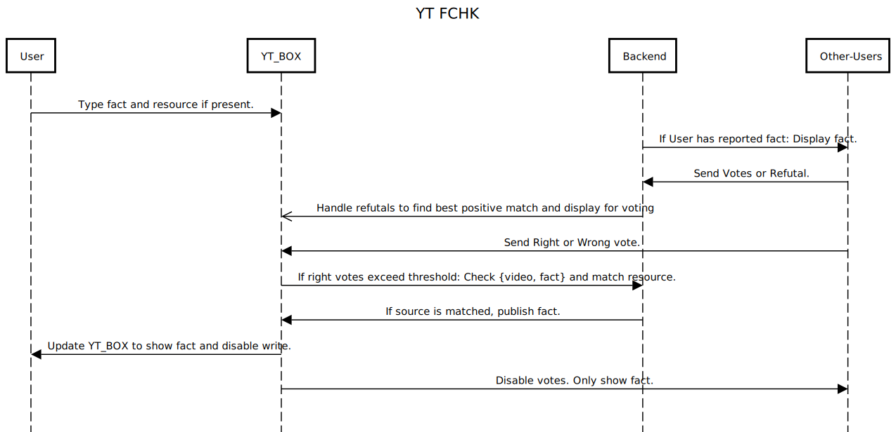

## YT FCHK

[ Learning Project of SIT CSE 6th Sem, MERN Group ]

An extension to crowd source facts to show for YouTube Videos.

## FAQ

1. How are facts checked?

> First mass voting is done against a fact report. Then a mass up-voted fact is sent with a source "resource". If resource and fact are judged to be compliant, then the fact is published. A resource is mandatory for a fact report.

2. How is botting/manipulation mitigated?

>  Since this is a learning project, we are working actively on strategies to minimise this. For now, we rely on authoratative & valid resource to fact report matching and mass upvoting.

3. Is fact report identifiable?

> No reports are fully anonymized however sources must be public and authoratative statements.

## Sequence Diagram

